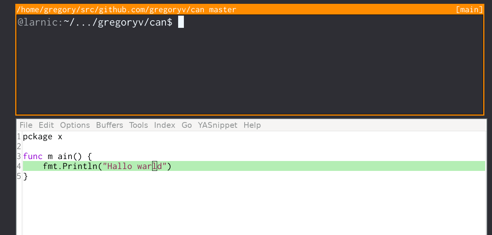

can - command line interface to openai

If you don't know which can I'm referring to; read the book
[Expeditionary Forces](https://www.goodreads.com/series/185650-expeditionary-force).

[OpenAI API-Reference](https://platform.openai.com/docs/api-reference)

## Quick start

    $ go install github.com/gregoryv/can/cmd/can@latest
    $ can --help

