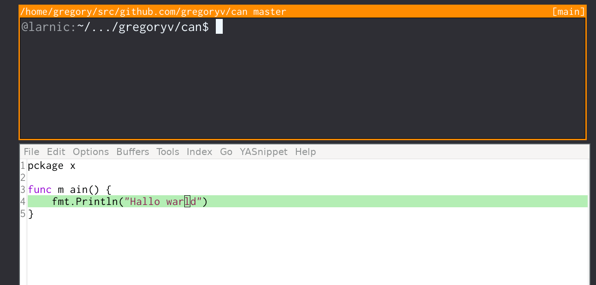

can - command line interface to openai

If you don't know which can I'm referring to; read the book
[Expeditionary Forces](https://www.goodreads.com/book/show/3361793-expeditionary-forces).

[OpenAI API-Reference](https://platform.openai.com/docs/api-reference)

## Quick start

    $ go install github.com/gregoryv/can@latest
    $ can --help
    Usage: can [OPTIONS]
    
    Options
        -a, --api-key-file, $OPENAI_API_KEY_FILE : "/home/gregory/.openai.key"
        -in : ""
            path to file or block of text
    
        -h, --help
    
    Examples
        Ask a question
        $ can why is the number 42 significant?
    
        Provide context
        $ can correct spelling -in ./README.md
        $ can correct spelling -in "hallo warld"

